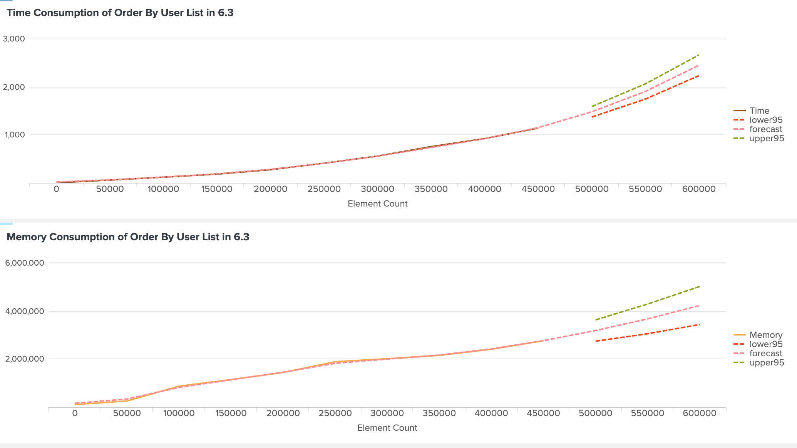

# Splunk NSO Integration Example - Streaming Performance Data Collector (Lux Edition)
This repository provide a Data Collection and Processing Pipeline for Cisco NSO that collect performance related data(for example memory and time consumtpion), Process the collected data and stream to Splunk for further processing. This testbed is based on Erlang Lux test framwork. Lux is one of the test framwork that is closest to the network engineer mindset by asking for a input command and see if the output is expected. By benifit from the design of Lux, we create this Data Collection and Processing Pipeline that can easily adapt any NSO use case scenrio. 

# Dependency
* opentelemetry-collector - https://github.com/open-telemetry/opentelemetry-collector/tree/main  
* opentelemetry-api==1.15.0
* opentelemetry-exporter-otlp==1.15.0
* opentelemetry-exporter-otlp-proto-grpc==1.15.0
* opentelemetry-exporter-otlp-proto-http==1.15.0
* opentelemetry-proto==1.15.0
* opentelemetry-sdk==1.15.0
* opentelemetry-semantic-conventions==0.36b0
This example is based on the Reproduction Framwork v3.0

# Requirment
* Python3.11 - Python3.12 will have issue when building setuptools. 
* python3.11-dev
* python3.11-distutils
* Lux Test Framwork - https://github.com/hawk/lux

* Splunk
	* Splunk Enterprise
		* Local Install - https://www.splunk.com/en_us/download/splunk-enterprise.html
		* Splunk Docker Container - https://hub.docker.com/r/splunk/splunk/
	* Splunk Cloud - https://www.splunk.com/en_us/products/splunk-cloud-platform.html

# Framwork Structure
```
.
├── Makefile
├── ReadMe
├── curr.sh
├── data -> local data copy and cache
├── data_collect.sh  -> data collection
├── data_processing.sh -> data collection stop and data processing
├── lib
│   └── splunk.py -> API that Stream data to splunk 
├── logs -> log of the process(not in use)
├── ncs-cdb -> CDB that used for testing
├── packages -> packages that used for testing
│   └── predictive_service -> Sample Service that incrase order by user list length
├── requirments.txt -> python dependency
├── run -> OTEL Collector
│   ├── Dockerfile
│   ├── README.md
│   ├── docker-compose.yml
│   ├── otel-collector-config.yml -> Collector config file
│   └── splunk.yml
├── send_splunk.sh -> Stream data to splunk(use lib/splunk.py)
├── test.lux -> Action done per round
└── trigger.sh -> Iterate from 0 to MaxX and run test.lux per round
```

# Before Start
1. Modify the "token" and "endpoint" address in "run/otel-collector-config.yml" under various "exporters". At moment, it use example entry to show how things suppose to looks like. 
    * endpoint address - Splunk address
    * token - HEC token

2. Install dependency
    ```
    pip install -r requirments.txt
    ```
3. If you have any other package that want to run together with the example, please also copy to the same folder nso/packages. 

# Usage
* Setup the Interation of Independent Variable at MaxX and the interval between each Independent Variable at INTERVAL in the Makefile. For example, the one below will run thes test from 0 to 450000 with 50000 apart.
    ```
    MaxX = 450000
    INTERVAL = 50000
    ```

* test.lux defined the command sequence that will trigger per data collection round. This is based on the Lux Test Framwork. Lux act as interactive test framwork by specify a input command (!) and see if the expected output came back(? or ???). A sample test.lux is provided and user need to modify the test.lux by adding NSO Startup Command in "nso", Preparation before data collection in the first "trigger" shell, trigger the activity that want to collect under the second "trigger" shell and eventually the clean up before end of the collection in "cleanup". The "collect" shell before the second "trigger" shell calls
    ```
    make collect
    ```
    which marks the start of the data collection. While the second "collect" shell before the cleanup calls the following to mark the end of data collection and start data processing. 
    ```
    make X=$X stop_collect
    ```
* Define data collection command in "data_collect.sh". At moment, the "data_collect.sh" collect the memory consumption and time consumption of the activity in the second "trigger" shell in test.lux

* Stop Data Collection and start define data processing in "data_processing.sh". At moment "data_processing.sh" takes the average of the memory utilization across entire activity under the second "trigger" shell in test.lux. At the same time, substract the end_time towards start_time to get time consumption.

* The data processed in "data_processing.sh"  will be directly stream to the OTEL collector than forward to Splunk via send_splunk.sh.  The "http://10.5.0.5:4318" behind send_splunk.sh is the IP address of the OTEL collector. send_splunk.sh called the OTEL SDK under "lib/splunk.py". At moment, "lib/splunk.py" stream the Independent Value x, Memory Utilization mem and Time Consumption time. If one would like stream other data, please modify the "current_span.set_attribute" under the send_trace function below in "lib/splunk.py".
   ```
    def send_trace(tracer,msg,mem,time,kvs=""):
        with tracer.start_as_current_span("span-name") as current_span:
            print("sending: "+msg + " "+kvs+" " + mem+" " + time)
            #current_span = trace.get_current_span()
            #current_span.add_event(msg)
            current_span.set_attribute("x", msg)
            current_span.set_attribute("mem", mem)
            current_span.set_attribute("time", time)
    ```
* Startup entire pipeline with 
        ```
        make clean build test
        ```
    or if the pipeline will consume a lot of time, run the test in the background. 
        ```
        nohup make clean build test &
        ```


# Overview Diagram	
```
┌─────────────────┐                    ┌────────┬─────────────────┌────────┐                         ┌─────────────────┐
│                 │                    │        │                 │        │                         │                 │
│                 │                    │        │                 │        │        4317-grpc        │                 │
│    Splunk       ◄────────8088────────┤Exporter│   Collector     │Receiver│◄───────4318-http────────┼  Data Collector │
│                 │                    │        │                 │        │                         │                 │
│                 │                    │        │                 │        │                         │                 │
│                 │                    │        │                 │        │                         │                 │
└─────────────────┘                    └────────┴─────────────────└────────┘                         └─────────────────┘

```


# Sample Splunk Filter
Use the filter blow will plot the line chart of the Memory consumption with ML StateSpaceForecast for forcast of 3 timeline ahead(forecast_k). "attributes.time" can change to "attributes.mem" to get the memory utilization. 
```
# Pre-process
index="events_perf" 
| chart values(attributes.time) over attributes.x 
| rename attributes.x as "Element Count" 
| rename values(attributes.time) as "Time" 
| append [| makeresults | eval "Element Count"=500000 ] 
| append [| makeresults | eval "Element Count"=550000 ]
| append [| makeresults | eval "Element Count"=600000 ]
| fields - _time 
| sort "Element Count"

# Train Model
| fit StateSpaceForecast "Time" output_metadata=true holdback=0 forecast_k=3 into "app:forecast"

# Post-processing
| rename predicted(Time) as forecast
| rename lower95(predicted(Time)) as lower95
| rename upper95(predicted(Time)) as upper95

```

This will create the Diagram like the one below for Time and Memory



## Copyright and License Notice
``` 
Copyright (c) 2024 Cisco and/or its affiliates.

This software is licensed to you under the terms of the Cisco Sample
Code License, Version 1.1 (the "License"). You may obtain a copy of the
License at

               https://developer.cisco.com/docs/licenses

All use of the material herein must be in accordance with the terms of
the License. All rights not expressly granted by the License are
reserved. Unless required by applicable law or agreed to separately in
writing, software distributed under the License is distributed on an "AS
IS" BASIS, WITHOUT WARRANTIES OR CONDITIONS OF ANY KIND, either express
or implied.
``` 
